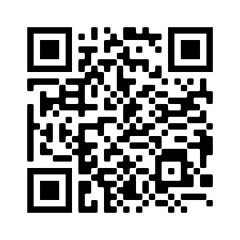

# 

The [LamdaX](https://lamdax.io) project was initiated as an opportunity to lead the Digital Maintenance Management 
industrial by designing and delivering a CMMS that is built on reputable and secure blockchain 
technology. 

Our aim is to utilise blockchain technology to develop a fully operable CMMS/EAM system that 
incorporates all aspects of Physical Asset Management. The system is to provide all the functionality 
(and more) of the current products available in the market but offer customers the benefits that 
blockchain technology and smart contracts bring.
Read more about this in our [whitepaper](https://lamdax.io/wp-content/uploads/2021/05/Whitepaper-LamdaX.pdf).

## Token

The LMX token is the native token for the LamdaX project and the main funding mechanism. It 
operates and trades on the Binance Smart Chain.

### 

| Field | Value |
| --- | --- |
| Name | LamdaX |
| Contract address  | [0x720e02FDa21C2d632A8747c70F5D9EA049521932](https://bscscan.com/token/0x720e02fda21c2d632a8747c70f5d9ea049521932)  |
| Symbol | LMX |
| Ticker | LMX |
| Decimals | 18 |
| QR code  |   |
| Logo |  |
| Contract | [Link](https://bscscan.com/address/0x720e02fda21c2d632a8747c70f5d9ea049521932#code) |

| Field | Value |
| --- | --- |
| Name | LamdaX |
| Contract address  | [0x974539b47033357475372996Ce7de406CCE71a82](https://bscscan.com/address/0x974539b47033357475372996Ce7de406CCE71a82)  |
| Symbol | LMX |
| Ticker | LMX |
| Decimals | 18 |
| QR code  |   |
| Logo |  |
| Contract | [Link](https://bscscan.com/address/0x974539b47033357475372996Ce7de406CCE71a82#code) |
